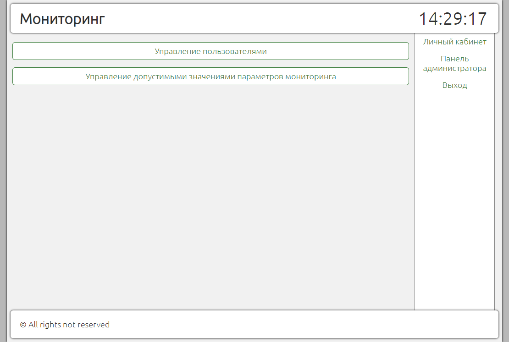

## Описание серверной части

Поддерживает сайт который отображает полученные от [трекера](https://github.com/Alamega/mitso-diplom-client) данные и информирует о систематических превышениях допустимых значений датчиков.

### Страница регистрации:

### Главная страница:

### Страница ПК:

### Панель администратора:

### Управления пользователями:

### Установка допустимых значений мониторинга:

### Пример уведомления о превышении допустимых значений:

### Пояснение о степени превышения на странице ПК:

